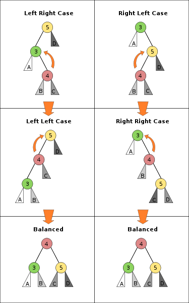

#AVL树小结

这一期的AVL树让我纠结了好久，不得不承认自己还是功底太浅。  

严蔚敏的《数据结构》实现的是在是太罗嗦了，而且这次wiki也帮不上太多的忙。有了思路，但是写了一半却被树高给卡住了，没办法只好看看大家的代码。

这找代码和相亲是一个道理，看对眼最重要～ 

最后看了一下`daimajia`的代码，个人觉得很不错，代码风格也很好，实现了我想实现的东西。突然觉得这哥们太给力了，嗯...，以后一定要好好学习~\(^o^)/~

####我对自己写代码的要求：

1. 结构清晰，遵循KISS原则。
2. 注释完整，关键地方要有说明。
3. 尽量遵循编码规范，方法/变量命名有意义

##遇到的问题

1. 树高的存储和bf的使用
2. 删除节点后，回溯调整树平衡

****

下面这张图挺好的，看着思路比较清晰：  

****  

这一次学到的东西比前两次要多，好好整理，写篇blog总结一下。
